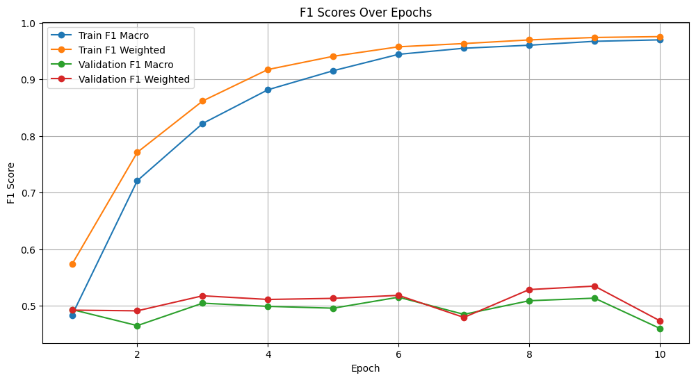
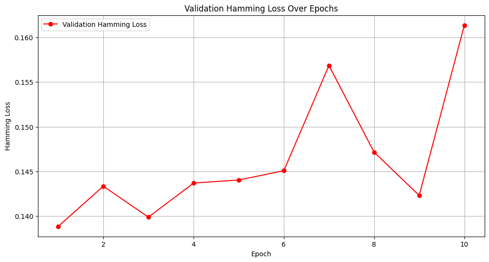
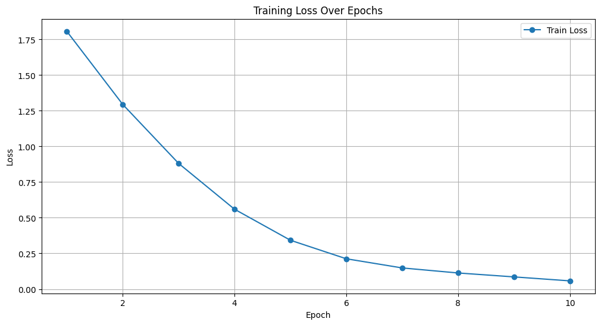
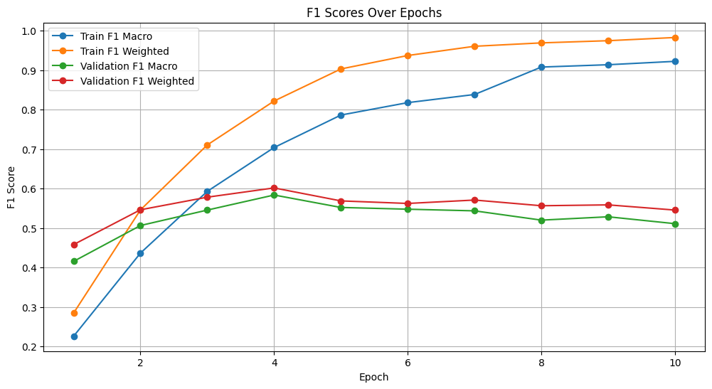
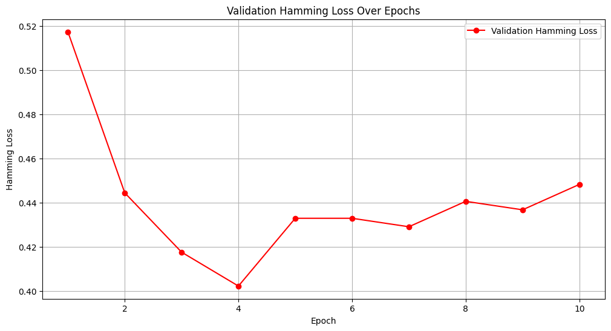

# Mental health meme classification

## Dataset

### Depressive dataset

The dataset has 8 categories

```
Lack of Interest
Self-Harm
Feeling Down
Concentration Problem
Lack of Energy
Sleeping Disorder
Low Self-Esteem
Eating Disorder
```

### Anxiety dataset

The dataset has 8 categories

```
Nervousness
Lack of Worry Control
Excessive Worry
Restlessness
Difficulty Relaxing
Impending Doom
Irritatbily
Unknown
```

Ignore the below **Unknown** images in the anxiety dataset: `TR-2027, TR-2094, TR-212`

## Task

1. Model for Depression (Multi-Label Classification)

    - Objective: Predict one or more of the 7 depression categories for a given meme.

2. Model for Anxiety (Single-Label Classification)

    - Objective: Predict one of the 8 anxiety categories for a given meme.

## URLS

Overleaf document link: [Overleaf](https://www.overleaf.com/project/67df3968f379053f3ccaf55e)

Common document (docs) link: [Docs](https://docs.google.com/document/d/1gIpCO9sxX8YXN0CIDuMw5P5mokUMzSWILebsZNbfFf0/edit?usp=sharing)

Paper: [Figurative-cum-Commonsense Knowledge Infusion for Multimodal Mental Health Meme Classification](https://arxiv.org/abs/2501.15321)

## Baseline Implementation

### **Overview**

The baseline implementation focuses on leveraging **OCR text** extracted from memes and using **BERT embeddings** for classification. The models were trained and evaluated using the following setup:

### **Depression Task**

- **Type**: Multi-Label Classification
- **Model**: BERT (`bert-base-uncased`) with a classification head.
- **Input**: OCR text extracted from memes.
- **Loss Function**: Binary Cross-Entropy Loss (`BCEWithLogitsLoss`).
- **Metrics**:
  - Macro F1 Score
  - Weighted F1 Score
  - Hamming Loss
- **Training Details**:
  - **Optimizer**: AdamW
    - Learning Rate: `5e-5`
    - Beta1: `0.9`
    - Beta2: `0.999`
    - Epsilon: `1e-8`
    - Weight Decay: `1e-2`
  - **Scheduler**: Constant learning rate.
  - **Dropout**: `0.2`
  - **Batch Size**: `16`
  - **Max Sequence Length**: `512`
  - **Gradient Clipping**: `1.0`
  - **Epochs**: `10`
- **Output**:
  - Best model (`best_model.pt`) saved based on validation Macro F1 score.
  - Last model (`last_model.pt`) saved after the final epoch.
  - Training logs (`training_logs.csv`) with epoch-wise metrics.
  - Test evaluation results (`test_report.txt`).

### **Anxiety Task**

- **Type**: Single-Label Classification
- **Model**: BERT (`bert-base-uncased`) with a classification head.
- **Input**: OCR text extracted from memes.
- **Loss Function**: Cross-Entropy Loss.
- **Metrics**:
  - Accuracy
  - Macro F1 Score
  - Weighted F1 Score
  - Hamming Loss
- **Training Details**:
  - **Optimizer**: AdamW
    - Learning Rate: `5e-5`
    - Beta1: `0.9`
    - Beta2: `0.999`
    - Epsilon: `1e-8`
    - Weight Decay: `1e-2`
  - **Scheduler**: Constant learning rate.
  - **Dropout**: `0.2`
  - **Batch Size**: `16`
  - **Max Sequence Length**: `512`
  - **Gradient Clipping**: `1.0`
  - **Epochs**: `10`
- **Output**:
  - Best model (`best_model.pt`) saved based on validation Macro F1 score.
  - Last model (`last_model.pt`) saved after the final epoch.
  - Training logs (`training_logs.csv`) with epoch-wise metrics.
  - Test evaluation results (`test_report.txt`).

---

### **Implementation Details**

1. **OCR Text**:
    - The OCR text extracted from memes is used as the primary input for both tasks.
    - The text is tokenized using the BERT tokenizer (`bert-base-uncased`) with a maximum sequence length of `512`.

2. **BERT Embeddings**:
    - Pre-trained BERT embeddings (`bert-base-uncased`) are fine-tuned for both tasks.
    - A classification head is added on top of the BERT model:
      - For the depression task, the output layer has 7 neurons (one for each category) with a sigmoid activation function.
      - For the anxiety task, the output layer has 8 neurons (one for each category) with a softmax activation function.

3. **Training and Evaluation**:
    - Both tasks are trained for `10 epochs` using the AdamW optimizer and a constant learning rate scheduler.
    - Metrics such as Macro F1, Weighted F1, and Hamming Loss are calculated for evaluation.

4. **Outputs**:
    - Models (`best_model.pt` and `last_model.pt`) are saved in the respective output directories.
    - Training logs (`training_logs.csv`) and test evaluation results (`test_report.txt`) are saved for analysis.

### **Results**

#### **OCR Text + BERT**

##### **Depression Task**

- **Summary of Metrics**:
  - **Macro F1 Score**: `55.27%`
  - **Weighted F1 Score**: `62.36%`
  - **Hamming Loss**: `0.1067`

- **Explanation**:
  - The depression task achieved similar performance to paper, with a **Macro F1 Score** of `55.27%`, indicating balanced performance across all categories. The **Weighted F1 Score** of `62.36%` reflects better performance on more frequent categories.

  - The **Hamming Loss** of `0.1067` suggests that the model makes relatively few errors in its predictions, which is expected for a multi-label classification task.

  - The training process shows consistent improvement in both **Macro F1** and **Weighted F1** scores across epochs, as seen in the training logs.

  - Compared to the paper's reported metrics (**Macro F1 Score**: `58.16%`, **Weighted F1 Score**: `57.12%`), the model's **Weighted F1 Score** surpasses the paper's results, while the **Macro F1 Score** is slightly lower, indicating room for improvement in balancing performance across all categories.

- A training loss vs. epochs graph is available for visualization:  
  

- A F1 Scores vs. epochs graph is available for visualization:  
  

- A Validation Hamming Loss vs. epochs graph is available for visualization:  
  


##### **Anxiety Task**

- **Summary of Metrics**:
  - **Accuracy**: `55.37%`
  - **Macro F1 Score**: `47.46%`
  - **Weighted F1 Score**: `55.48%`
  - **Hamming Loss**: `0.4463`

- **Class-wise Performance**:
  | Class                  | Precision | Recall | F1-Score | Support |
  |------------------------|-----------|--------|----------|---------|
  | Difficulty Relaxing    | 71.43%    | 63.73% | 67.36%   | 102     |
  | Excessive Worry        | 46.85%    | 56.52% | 51.23%   | 92      |
  | Impending Doom         | 65.06%    | 51.43% | 57.45%   | 105     |
  | Irritability           | 46.43%    | 35.14% | 40.00%   | 37      |
  | Lack of Worry Control  | 57.30%    | 54.26% | 55.74%   | 94      |
  | Nervousness            | 60.17%    | 66.98% | 63.39%   | 106     |
  | Restlessness           | 41.67%    | 47.83% | 44.53%   | 115     |
  | Unknown Anxiety        | 0.00%     | 0.00%  | 0.00%    | 1       |

- **Explanation**:
  - The model achieved similar performance to paper on the anxiety task, with an overall accuracy of `55.37%`. The **Macro F1 Score** of `47.46%` indicates that the model's performance is not uniform across all classes, as it gives equal weight to each class regardless of its size. The **Weighted F1 Score** of `55.48%` reflects better performance on larger classes like "Nervousness."

  - The **Hamming Loss** of `0.4463` suggests that the model makes errors in nearly half of the predictions, which is expected given the complexity of the task.

  - Class-wise, the model performed best on "Nervousness" with an F1-Score of `63.39%`, while "Irritability" had the lowest F1-Score of `40.00%`, indicating room for improvement in handling smaller or more ambiguous classes.

  - Compared to the paper's reported metrics (**Macro F1 Score**: `62.99%`, **Weighted F1 Score**: `63.06%`), the model's performance is lower, highlighting the need for further optimization to match or exceed the baseline results.

  - Additionally, we have included two extra classes, **Irritability** and **Unknown Anxiety**, which were not present in the paper. This may have contributed to the differences in performance metrics.

- A training loss vs. epochs graph is available for visualization:  
  

- A F1 Scores vs. epochs graph is available for visualization:  
  

- A Validatioin Hamming Loss vs. epochs graph is available for visualization:  
  
